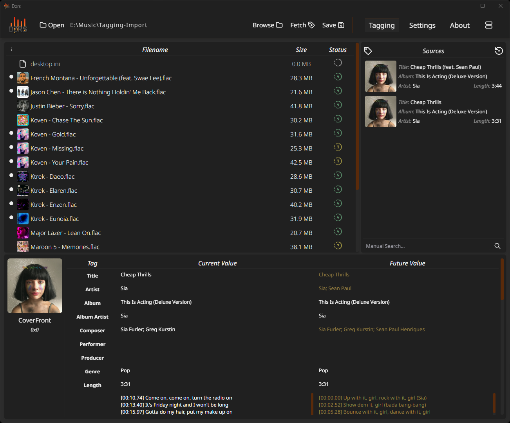
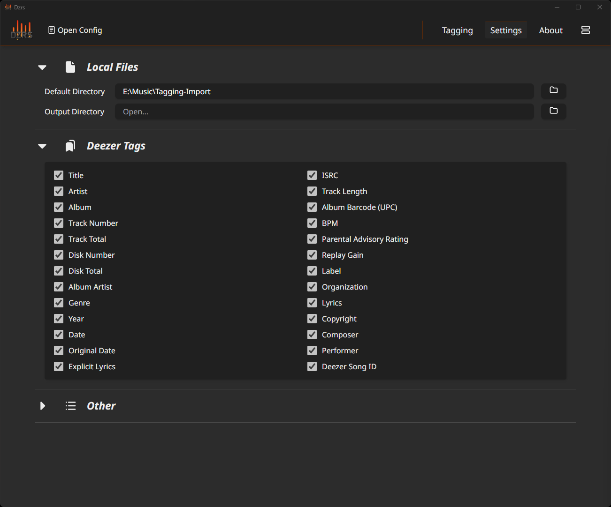

    

### DISCLAIMER: Currently work in progress, while downloading works (when slavart decides to fix their backend), tagging still needs some work, the sources panel isnt implemented yet, and overall a lot of features need to be added/fixed.

## Features

- **Download High-Quality Tracks**: Utilizes the Slavart API to download tracks in FLAC format.

- **Tag Management**: View and edit metadata tags of FLAC files.

- **Deezer Integration**: Retrieve tags from Deezer using their API.

## Getting Started

Head over to the [releases](https://github.com/Guido30/Dzrs/releases) page and download the installer.

## Preview

    

    

## Notice

Dzrs is a personal project, and while im happy to develop it, future updates and mantainance might not be guaranteed.  
If slavart decides to shut down their api or if it goes down one day, downloading tracks wont be a thing anymore.  
So feel free to open an issue or fork the project it ever stops working.

## License

This software is free to use. Refer to the [LICENSE](LICENSE) for more details.
